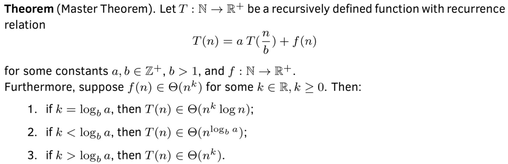

DataStructures_and_Algorithms
Click [here](../README.md) to main page

Table of Contents:
- [Divide and Conquer](#divide-and-conquer)
  - [Master Theorem](#master-theorem)
- [Examples:](#examples)
    - [Merge Sort, runtime: O(n log n)](#merge-sort-runtime-on-log-n)
    - [Find Smallest Not Belong To List](#find-smallest-not-belong-to-list)
    - [Binary Search](#binary-search)
    - [Bisect Left](#bisect-left)
    - [Bisect Right](#bisect-right)
    - [Find Peak Element](#find-peak-element)
    - [Divide Chocolate](#divide-chocolate)
    - [Shortest Distance to Target Color](#shortest-distance-to-target-color)
    - [Longest Increasing Subsequence](#longest-increasing-subsequence)
    - [Different Ways to Add Parentheses](#different-ways-to-add-parentheses)
    - [Split Array Largest Sum](#split-array-largest-sum)
    - [Range Module](#range-module)
    - [Minimize the Maximum Difference of Pairs](#minimize-the-maximum-difference-of-pairs)
    - [Search in Rotated Sorted Array II](#search-in-rotated-sorted-array-ii)
    - [Find First and Last Position of Element in Sorted Array](#find-first-and-last-position-of-element-in-sorted-array)
    - [Find in Mountain Array](#find-in-mountain-array)

## Divide and Conquer
- **Divide**: divide the problem into two or more smaller instances of the same problem (subproblems)
- **Conquer**: if the subproblem is small enough, return the solution directly; otherwise, solve it recursively
- **Combine**: combine the solutions to the subproblems to solve the original problem

If a question works for condition x, and it implies that it workds for condition x - 1, x - 2, ... 0. Then we can consider to use Divide and Conquer to solve this question because at each iteration, we can find the mid point and vertify if it works for mid, if so, we can get rid of half of the list and move it to the other half.

### Master Theorem
It applies to runtime of divide-and-conquer algorithms when subproblems all have the **same** size, roughly.

## Examples:
#### [Merge Sort](./merge_sort/description.md), runtime: O(n log n)
#### [Find Smallest Not Belong To List](./find_smallest_not_belong/description.md)
#### [Binary Search](binary_search/description.md)
#### [Bisect Left](bisect_left/description.md)
#### [Bisect Right](bisect_right/description.md)
#### [Find Peak Element](find_peak_element/description.md)
#### [Divide Chocolate](divide_chocolate/description.md)
#### [Shortest Distance to Target Color](shortest_distance_to_target_color/description.md)
#### [Longest Increasing Subsequence](longest_increasing_subsequence/description.md)
#### [Different Ways to Add Parentheses](different_ways_to_add_parentheses/description.md)
#### [Split Array Largest Sum](split_array_largest_sum/description.md)
#### [Range Module](range_module/description.md)
#### [Minimize the Maximum Difference of Pairs](./minimize_the_maximum_difference_of_pairs/description.md)
#### [Search in Rotated Sorted Array II](./search_in_rotated_sorted_array_II/description.md)
#### [Find First and Last Position of Element in Sorted Array](./find_first_and_last_position_of_element_in_sorted_array/description.md)
#### [Find in Mountain Array](./find_in_mountain_array/description.md)
#### [Minimum Number of Days to Make m Bouquets](./minimum_number_of_days_to_make_m_bouquets/description.md)
#### [Magnetic Force Between Two Balls](./magnetic_force_between_two_balls/description.md)
#### [Find Kth Smallest Pair Distance](./find_kth_smallest_pair_distance/description.md)
#### [Minimized Maximum of Products Distributed to Any Store](./minimized_maximum_of_products_distributed_to_any_store/description.md)
#### [Minimum Limit of Balls in a Bag](./minimum_limit_of_balls_in_a_bag/description.md)
#### [Find Longest Special Substring That Occurs Thrice I](./find_longest_special_substring_that_occurs_thrice_i/description.md)
#### [Zero Array Transformation II](./zero_array_transformation_ii/description.md)
#### [Maximum Candies Allocated to K Children](./maximum_candies_allocated_to_k_children/description.md)
#### [House Robber IV](./house_robber_iv/description.md)