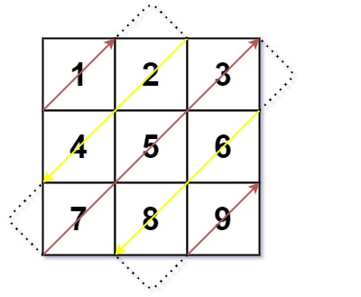

## Hashing
Click [here](../notes.md) to go back to the notes page.

## Question
Given a matrix of $M \times N$ elements (M rows and N columns), return all elements in the following image.

 


## Example
```
Input:
[
    [1, 2, 3],
    [4, 5, 6],
    [7, 8, 9]
]

Output: [1, 2, 4, 7, 5, 3, 6, 8, 9]
```

## Key Idea
From previous notes, we know that we can group all the elements on the same anti-diagonal to a hash map by using the key $i + j$. Thus we will first use a hash map to store all the anti-diagonals. Notice the first anti-diagonal has a value 0 and second anti-diagonal has a value of 1 and so on. Also notice the first anti-diagonal we append it in reverse direction and second anti-diagonal we append it in the regular direction.

Thus we can loop over each diagonal keys, extend it if its key is odd and extend it in reversed direction if its key is even. 

## Solution
- [Python Solution](diagonal_traverse.py)